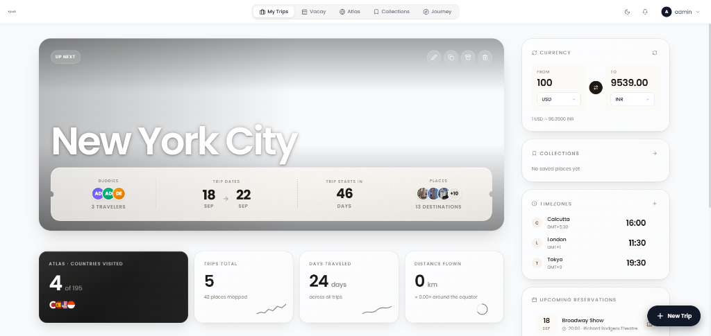
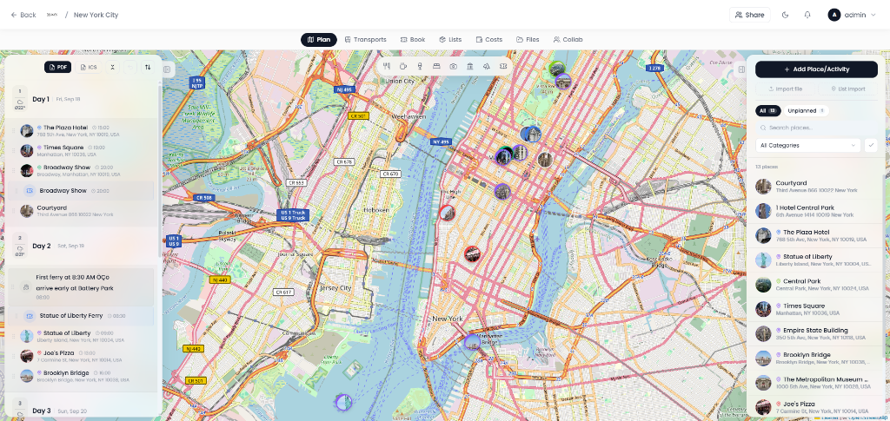
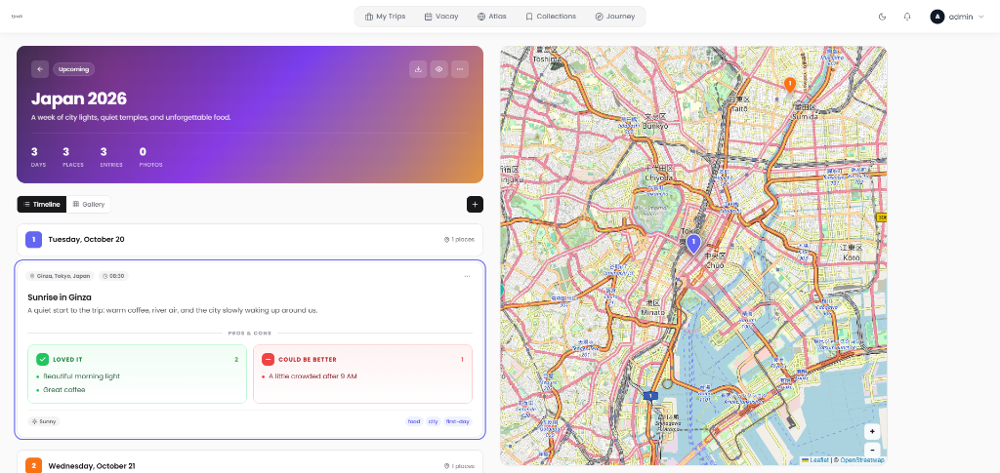
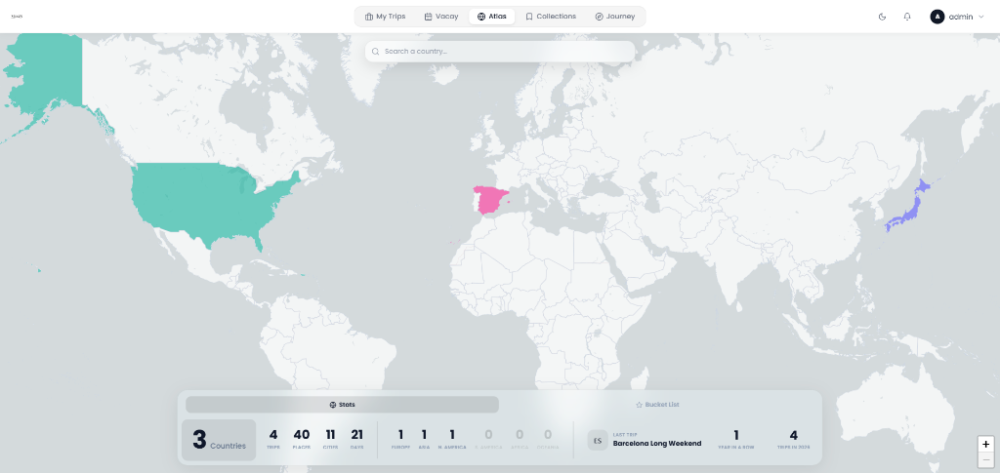
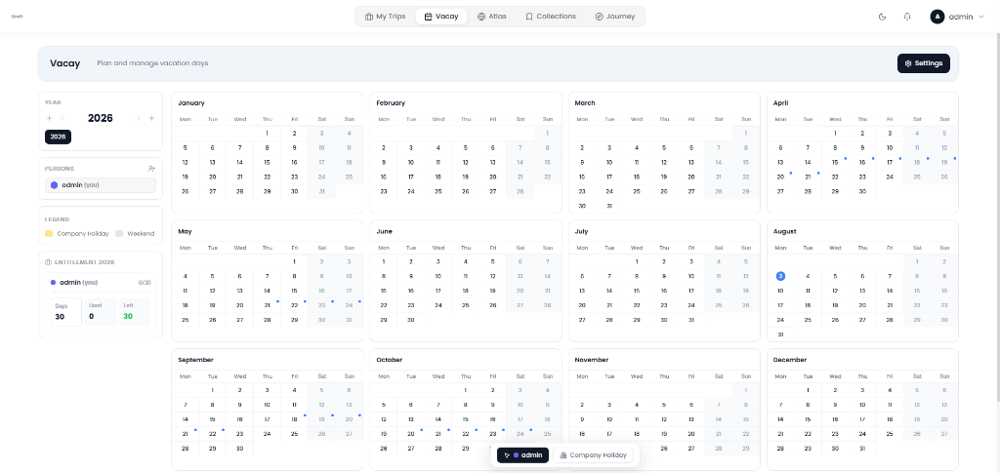

<div align="center">


# MooNsPlanner

### ✈️ Self-hosted Travel Planning & Exploration Platform

*Plan your adventures. Own your data. No tracking, no subscriptions, no strings attached.*

[](LICENSE)
[](https://github.com/schowdary75/MooNsPlanner/stargazers)
[](https://github.com/schowdary75/MooNsPlanner/issues)

<br />

[Features](#-features) · [Screenshots](#-screenshots) · [Quick Start](#-quick-start) · [Tech Stack](#-tech-stack) · [Configuration](#️-configuration) · [Contributing](#-contributing)

<br />

---

</div>

## 📸 Screenshots

<div align="center">

### 🏠 Dashboard — Your Travel Command Center



> *At-a-glance view of upcoming trips, travel stats, currency converter, world timezones, and upcoming reservations — everything a traveler needs in one place.*

<br />

### 🗺️ Interactive Trip Planner



> *Drag-and-drop day-by-day itinerary builder with an interactive map. Add places, activities, and notes — see everything on the map in real-time.*

<br />

### 📓 Travel Journal — Relive Your Adventures



> *Document your experiences with the built-in travel journal. Rate places with pros & cons, tag entries, and track your journey timeline with photos and maps.*

<br />

### 🌍 Atlas — Track Your Global Footprint



> *Visualize every country you've visited on an interactive world map. Track your travel statistics — countries, cities, days traveled, and distance flown across continents.*

<br />

### 🏖️ Vacay — Manage Your Time Off



> *Annual vacation day planner with calendar view. Track used days, remaining balance, company holidays, and plan your time off across the entire year.*

</div>

---

## ✨ Features

<table>
<tr>
<td width="50%">

### 🗺️ Trip Planning
- Multi-day itinerary builder with drag-and-drop
- Interactive maps with POI discovery
- Real-time route visualization
- PDF & ICS export

### ✈️ Flight & Transport
- Flight tracking with airport data
- Route mapping and transport modes
- Booking import via AI email parsing

### 💰 Budget & Currency
- Multi-currency expense tracking
- Live currency conversion
- Per-trip cost breakdowns

</td>
<td width="50%">

### 🌍 Atlas & Collections
- World map with visited countries
- Travel statistics & continent breakdown
- Curated place collections & bucket lists

### 📓 Journal & Media
- Day-by-day travel journaling
- Pros & cons ratings for places
- Photo galleries & file attachments
- Tags, weather, and mood tracking

### 🔐 Privacy & Security
- 100% self-hosted — your data stays yours
- SSO / OpenID Connect (OIDC)
- Multi-factor authentication (MFA)
- Zero telemetry, zero tracking

</td>
</tr>
</table>

### More Features

| Feature | Description |
|---|---|
| 🏖️ **Vacay Planner** | Annual vacation day management with calendar view |
| 🔔 **Smart Notifications** | Email, in-app, and webhook alerts (Slack, etc.) |
| 🌐 **20+ Languages** | Fully internationalized UI |
| 🔌 **Plugin System** | Extend with custom plugins via built-in SDK |
| 📱 **Progressive Web App** | Installable PWA — works on any device |
| 🐳 **Docker Ready** | One-command deployment with Docker Compose |
| ☸️ **Helm Chart** | Production-ready Kubernetes deployment |
| 👥 **Collaboration** | Share trips and collaborate with travel buddies |
| 🌙 **Dark Mode** | Beautiful light & dark themes |
| ⏰ **Timezone Widget** | Track multiple timezones at a glance |

---

## 🚀 Quick Start

### Docker Compose (Recommended)

```bash
git clone https://github.com/schowdary75/MooNsPlanner.git
cd MooNsPlanner
cp server/.env.example server/.env
# Edit server/.env with your settings
docker compose up -d
```

Visit `http://localhost:3001` — an admin account is created on first boot (check the server logs for the password).

### From Sources

```bash
git clone https://github.com/schowdary75/MooNsPlanner.git
cd MooNsPlanner
npm install
npm run dev
```

> See [`build-from-sources`](build-from-sources) for detailed build instructions.

---

## 🛠️ Tech Stack

| Layer | Technology |
|---|---|
| **Frontend** | React 19, TypeScript, Vite |
| **Backend** | NestJS, TypeScript |
| **Database** | MariaDB / SQLite |
| **Maps** | Leaflet, Overpass API |
| **Auth** | JWT, OIDC, MFA |
| **AI** | LLM-powered booking import & itinerary parsing |
| **Deploy** | Docker, Helm, Unraid |
| **PWA** | Service Worker, Offline Support |

---

## ⚙️ Configuration

All configuration is done via environment variables. See [`.env.example`](server/.env.example) for the full list.

<details>
<summary><strong>Key Configuration Variables</strong></summary>

| Variable | Description | Default |
|---|---|---|
| `PORT` | Server port | `3001` |
| `NODE_ENV` | `development` or `production` | `development` |
| `ALLOWED_ORIGINS` | CORS origins (comma-separated) | — |
| `FORCE_HTTPS` | Enable HTTPS redirect & HSTS | `false` |
| `MARIADB_HOST` | MariaDB hostname | `127.0.0.1` |
| `MARIADB_PORT` | MariaDB port | `3306` |
| `MARIADB_USER` | MariaDB username | `root` |
| `MARIADB_PASSWORD` | MariaDB password | — |
| `MARIADB_DATABASE` | MariaDB database name | `moons` |
| `OIDC_ISSUER` | OpenID Connect provider URL | — |
| `OIDC_CLIENT_ID` | OIDC client ID | — |
| `OIDC_CLIENT_SECRET` | OIDC client secret | — |
| `TZ` | Timezone for logs & reminders | `UTC` |

</details>

---

## 📁 Project Structure

```
MooNsPlanner/
├── client/              # React frontend (Vite + TypeScript)
│   ├── src/
│   │   ├── components/  # Reusable UI components
│   │   ├── pages/       # Route pages
│   │   ├── store/       # State management (Zustand)
│   │   └── i18n/        # Internationalization
│   └── public/          # Static assets & PWA manifest
├── server/              # NestJS backend
│   ├── src/
│   │   ├── nest/        # NestJS modules & controllers
│   │   ├── services/    # Business logic services
│   │   └── db/          # Database layer
│   └── .env.example     # Environment variable template
├── shared/              # Shared types, i18n, utilities
├── plugin-sdk/          # Plugin development SDK
├── charts/              # Helm chart for Kubernetes
├── scripts/             # Migration & utility scripts
├── docker-compose.yml   # Docker Compose config
├── Dockerfile           # Multi-stage Docker build
└── docs/
    └── screenshots/     # Application screenshots
```

---

## 🔒 Security

See [SECURITY.md](SECURITY.md) for our security policy and how to report vulnerabilities responsibly.

---

## 🤝 Contributing

We welcome contributions! Please read our [Contributing Guidelines](CONTRIBUTING.md) before submitting a pull request.

All contributions are subject to the project's [License](LICENSE).

---

## 📝 License

This project is **proprietary software**. All rights reserved.

> **You may NOT modify, redistribute, or use this software commercially without explicit written permission from the copyright holder.**

See [LICENSE](LICENSE) for full details.

---

## 👤 Author

<table>
<tr>
<td align="center">
<strong>MooN</strong><br />
<a href="https://github.com/schowdary75">@schowdary75</a><br />
<sub>Creator & Lead Developer</sub>
</td>
</tr>
</table>

---

<div align="center">

<sub>Built with ☕ and countless late nights by **MooN**</sub>

<br /><br />

⭐ **If MooNsPlanner helps you plan better adventures, consider giving it a star!** ⭐

</div>
